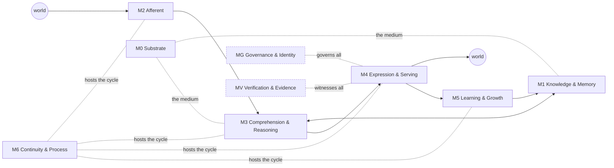

# Phase 1 — The Layer Taxonomy

**Executor:** Fable 5, 2026-07-27. **Verified against:** `forgejo/main` @ `8927c563`.
**Inputs:** `01-phase0-ground-truth.md` (the handoff), `AGENTS.md`, `ADR-0252`, `.system-map/` (2026-06-09 prior — local to the main worktree, gitignored).
**Companion:** `03-card-schema.md` (the metadata schema every card in Phases 2–3 must fill).

This document fixes the decomposition of CORE — macro to micro — that Phases 2 and 3 fill with cards, and Phase 4 audits against. Per Pillar I (Semantic Rigor), the taxonomy and its completeness criteria are fixed *before* any component is judged.

---

## 0. Decisions made by this phase

| # | Decision | Ruling |
|---|---|---|
| D1 | Which articulation is the spine? | **None of the five "wins."** They answer five different questions and become five axes/attributes of one taxonomy (§1). The functional axis is the AGENTS.md north star; the structural axis is a 7+2 macro-layer grouping of the system map's 33 zones. The taxonomy's job is auditing the *mapping* between the two. |
| D2 | Schema: adopt, extend, or replace the system map's? | **Extend.** Keep the 17 fields and the 7-value liveness vocabulary; add the four missing dimensions (evidence, capacity, design-vs-build, fitness) as orthogonal fields, not fatter enums (`03-card-schema.md`). |
| D3 | Completeness criterion | Fixed in §6: coverage is *evidence-bearing ownership of a functional stage*, completeness is per-layer and per-stage, and "missing" is distinguished from "explicitly deferred" by the presence of a ruling. |
| D4 | Where do candidate layers live? | The Candidate Register (§5) — four registered candidates (attention, agenda/drive, efferent action, temporal self-location), each with its telos derivation, partial existence, and the ruling it needs; plus a considered-and-not-registered line to show the boundary was examined. |
| D5 | Committed or local-only? | **Committed** (this branch → Forgejo PR). This artifact is governance-adjacent: it will drive R&D ordering and rulings, so it must be reviewable, versioned, and visible to every future session. The system map stays local as a regeneratable *navigation index*; the assessment is the *ruled record*. Staleness is handled by discipline, not by hiding: every card stamps the SHA at which its claims were verified. |

---

## 1. D1 — the reconciliation: five articulations, five different questions

Phase 0's Finding 0-A: CORE describes its own cognitive cycle five different ways, and no document maps any onto any other. The resolution is not to crown one. Read closely, the five are not competing answers to one question — they are answers to **five different questions**, and the apparent conflict dissolves once each is assigned to the axis it actually describes. (This is the Third Door applied to the taxonomy itself: the trade-off "which self-description do we keep?" is not split; it is dissolved.)

| Articulation | The question it answers | Kind | Disposition in this taxonomy |
|---|---|---|---|
| **North star** (`AGENTS.md`, 7 stages) | *What is the system for?* | Functional / teleological | **Adopted as the functional axis** (§2). Candidate extensions are registered separately (§5), never silently merged into it. |
| **Live path** (`AGENTS.md`, 9 steps) | *What happens on a turn today?* | Realized pathway | **Subsumed.** It is the serving traversal M2 → M3 → M4 → MV (§3). It becomes the spine of the M3/M4 layer cards — a pathway *through* the structure, not a decomposition *of* it. |
| **Mind-physics blueprint** (`docs/architecture/MIND-PHYSICS-BLUEPRINT.md`, Draft 2026-05-12) | *By what mechanisms?* | Mechanism proposal | **Recommend ruling: mark historical / partially superseded**, with the per-element disposition in §1.1. Its one orphan — Allocation Physics — moves to the Candidate Register as CR-1. |
| **ADR-0252 paradigm** (Accepted 2026-07-19) | *By what competence is problem-solving judged?* | Governing competence model | **Adopted as the governing competence model within M3.** Its five stages decompose the problem-solving pathway inside M3; its §4 conformance bar (deep structure, generalization ratio > 1) becomes a *fitness criterion* for M3 components in Phases 3–4. |
| **System map** (`.system-map/`, 2026-06-09) | *What is built, and where?* | Structural inventory | **Adopted as the sublayer stratum.** All 33 zones are retained and regrouped under 7+2 macro layers (§3–4); the 7-value liveness vocabulary is retained unchanged. |

The two-axis model that results:

- **Functional axis** — the stages of the cognitive cycle (what the organism does).
- **Structural axis** — macro layers → zones → components (what exists, in containment order).

Every structural card carries the functional stages it serves (`telos_stages`, already a system-map field). The assessment's central audit — run in Phase 2 with evidence, not here — is the **stage-coverage audit**: every functional stage must be owned by at least one live structural element (else a gap), and every structural element must serve at least one stage (else a fitness question). Neither axis can perform this audit alone; that is why neither "wins."

### 1.1 Disposition of the mind-physics blueprint, element by element

The blueprint is a Draft that was never advanced and never retracted. Its elements did not fail uniformly, so a uniform disposition would be dishonest. Recommended for ruling (this assessment records, it does not enact):

| Blueprint element | What became of it | Disposition |
|---|---|---|
| Identity Physics (IdentityCheck, ADR-0010) | Landed and hardened: wave-only fail-closed identity scoring (ADR-0244 §3, INV-32), identity manifold, identity packs | **Superseded by stronger implementations** — retire the blueprint's version of the claim |
| Compositional Physics (Binding/Digest/Trajectory/ArticulationPlanner, ADR-0009) | Landed as the proposition-graph lineage: `PropositionGraph → ArticulationTarget → realizer` | **Superseded** — same |
| Renderer ("TBD, ADR-0011 planned") | `generate/realizer.py` has been the shipping renderer for months | **Stale line** — retire |
| DriveGradientMap / ExertionMeter | Never built; no successor articulation anywhere | Moves to Candidate Register **CR-2** (agenda/drive) |
| **Allocation Physics** (SalienceOperator / AttentionOperator / InhibitionOperator, ADR-0008) | Never landed *as a layer*. Fragments exist under other names — see CR-1 | Moves to Candidate Register **CR-1** (attention/allocation) |

---

## 2. The functional axis

### 2.1 The ratified cycle (unchanged, from `AGENTS.md`)

```text
listen → comprehend → recall → think → articulate → learn from reviewed correction → replay deterministically
```

This is the canonical vocabulary for `telos_stages`. The system map's telos mapping (which zones serve which stage) is adopted as the *claimed* ownership baseline; Phase 2 verifies claims against evidence.

### 2.2 Claimed stage ownership (baseline — unverified until Phase 2)

| Stage | Primary owner (macro layer) | Supporting |
|---|---|---|
| listen | M2 Afferent Boundary | M1 (lexical substrate) |
| comprehend | M3 Comprehension & Reasoning | M1 (packs, vocabulary) |
| recall | M1 Knowledge & Memory | M3 (in-turn recall), M0 (exact CGA distance) |
| think | M3 Comprehension & Reasoning | M0 (the medium) |
| articulate | M4 Expression & Serving | M1 (packs), MG (governance of the surface) |
| learn | M5 Learning & Growth | M1 (promotion target), M6 (what persists) |
| replay | MV Verification & Evidence | *property enforced everywhere; apparatus lives in MV* |
| *(the cycle's runner)* | M6 Continuity & Process | **unbuilt at its center** — L11 process |

Candidate functions (attend, want/agenda, act, temporal self-location) are deliberately **not** rows in this table. They live in §5 until ruled into the cycle or ruled out.

---

## 3. The structural axis — seven macro layers, two cross-cuts

Macro layers are groupings of the 33 zones, carved at the joints the system's own contracts already respect (serve boundaries, trust boundaries, the INV regime). Each gets one card in Phase 2 (`10-layer-cards/`). One-paragraph teleology for each; full intent belongs on the card.

**M0 — Substrate.** The physical medium: Cl(4,1) algebra, the versor invariant, the field. Per the governing mental model, the field is the *electricity*, not the intelligence — M0 supplies closure, exactness, and replayability to everything above it, and is forbidden from containing cognition-specific policy. Zones: `L0-algebra`, `L1-field`.

**M1 — Knowledge & Memory.** What is known, at rest: the vault (exact recall), compiled packs, the vocabulary manifold, the lexical substrate (morphology, alignment), and memory's consolidation surface. The epistemic-status regime (SPECULATIVE/COHERENT/…) governs everything here. Zones: `L2-vault`, `L3-packs`, `vocab-manifold`, `morphology`, `alignment-resonance`, `L8-memory-contemplation` *(straddles M5 — consolidation is learning in motion)*.

**M2 — Afferent Boundary.** World → field: the ingest gate and compiler, the sensorium's afferent track, and environmental falsification. Every entry point is a trust boundary; nothing crosses without construction-boundary normalization. Zones: `ingest-boundary`, `ingest-compiler`, `sensorium-afferent`, `sensorium-falsification`.

**M3 — Comprehension & Reasoning.** The wiring that thinks: recognition, the cognition pipeline, the comprehend/determine/realize organs, the deduction flagship, curriculum-grounded reasoning, the math reader, and reasoning research. ADR-0252 governs this layer's competence bar; the two-grammars frontier (reader ≠ writer) lives here. Zones: `L4-recognition`, `L5-cognition`, `comprehend-organ`, `determine-phase`, `realize-phase`, `reasoning-deductive`, `gsm8k-math`, `field-wedge-research`.

**M4 — Expression & Serving.** Field → world: the chat runtime, surface selection policy, the register axis, response governance, and the epistemic-verdict surface. This layer owns *serving-path truth behavior* — what the user actually reads — and is therefore where `wrong=0` lives or dies. Zones: `L6-chat-runtime`, `L9-epistemic-verdicts` *(straddles MG — verdicts are governance made visible)*.

**M5 — Learning & Growth.** Controlled mutation: the reviewed teaching loop, formation/curriculum, reliability calibration and earned licenses, and the capability ledger. The typed learning boundary (durable-reviewed vs provisional-typed, INV-21…24/29/30) is this layer's constitution. Zones: `L7-teaching`, `formation-curriculum`, `reliability-calibration`, `capability` *(straddles MV — the ledger is also evidence)*.

**M6 — Continuity & Process.** The life itself: the always-on process (unbuilt), engine-state checkpointing (built), edge-sync, the turn protocol, session continuity, async HITL. The telos ("one continuous life") is this layer's charter, and its center is the single largest distance between stated purpose and built system. Zones: `L10-11-runtime-identity`, `engine-state`, `edge-sync`, `core-protocol-ctp`.

**MG — Governance & Identity** *(cross-cutting)*. Identity manifold and packs, safety pack (never-swappable, fail-closed), ethics packs, refusal taxonomy, trust boundaries, the INV regime as a body of law. Cross-cutting because its writ runs everywhere; a governance mechanism that only one layer obeys is a bug. Zone: `governance-identity-safety`.

**MV — Verification & Evidence** *(cross-cutting)*. Evals, lanes, pinned SHAs, CLAIMS.md, replay/determinism apparatus, telemetry/trace, the CLI test surface, workbench-as-auditor. Cross-cutting for the same reason; replay is a property of every layer and an apparatus of this one. Zones: `evals-determinism`, `tooling-cli-workbench-rs`.



---

## 4. The complete zone mapping

All 33 zones, mapped once. Liveness is the map's 2026-06-09 label — **48 days stale, claimed not verified**; Phase 2 re-verifies. Flags: ⚑ = zero-subsystem zone (Phase 3 must descend it first); ✱ = straddle (noted above).

| Zone | Macro layer | 2026-06-09 liveness | Note |
|---|---|---|---|
| L0-algebra | M0 | live-serving | |
| L1-field | M0 | partial-wiring-debt | |
| L2-vault | M1 | partial-wiring-debt | T1 discarded on exit (→ M6) |
| L3-packs | M1 | partial-wiring-debt | |
| vocab-manifold | M1 | live-serving | |
| morphology | M1 | live-internal | |
| alignment-resonance | M1 | live-internal | |
| L8-memory-contemplation ✱ | M1 ↔ M5 | partial-wiring-debt | consolidation straddle |
| ingest-boundary | M2 | partial-wiring-debt | |
| ingest-compiler | M2 | partial-wiring-debt | |
| sensorium-afferent | M2 | inert | |
| sensorium-falsification | M2 | live-internal | map labels it "L12" — a stratum no other document uses; flag for ruling |
| L4-recognition | M3 | partial-wiring-debt | |
| L5-cognition | M3 | partial-wiring-debt | |
| comprehend-organ ⚑ | M3 | live-serving | zero subsystems mapped |
| determine-phase ⚑ | M3 | live-serving | zero subsystems mapped |
| realize-phase ⚑ | M3 | live-serving | zero subsystems mapped; serve seam → M4 |
| reasoning-deductive | M3 | partial-wiring-debt | flagship; predates ADR-0256–0265 arc |
| gsm8k-math | M3 | partial-wiring-debt | demoted to diagnostic |
| field-wedge-research | M3 | research-negative | negative result = knowledge, not failure |
| L6-chat-runtime | M4 | partial-wiring-debt | |
| L9-epistemic-verdicts ✱ | M4 ↔ MG | partial-wiring-debt | |
| L7-teaching | M5 | partial-wiring-debt | |
| formation-curriculum | M5 | partial-wiring-debt | |
| reliability-calibration | M5 | partial-wiring-debt | |
| capability ✱ | M5 ↔ MV | live-internal | |
| L10-11-runtime-identity | M6 | partial-wiring-debt | center unbuilt (L11 process) |
| engine-state | M6 | live-internal | the built footing |
| edge-sync | M6 | inert | |
| core-protocol-ctp | M6 | spike | |
| governance-identity-safety | MG | live-serving | |
| evals-determinism | MV | partial-wiring-debt | |
| tooling-cli-workbench-rs | MV | partial-wiring-debt | |
| sensorium-falsification ⚑ | — | — | *(also zero-subsystem; listed once above)* |

Calibration to carry forward: at the **subsystem** stratum the 2026-06-09 map records 58 `live-serving` + 79 `live-internal` of 205 total (with 28 partial, 22 inert, 10 spike, 4 unbuilt, 4 research-negative). The organism is substantially more built than zone-level labels imply; the genuinely-unbuilt mass is concentrated in M6. Zone liveness is a weakest-link rollup and must never be quoted as a completion rate.

---

## 5. The Candidate Register (D4)

Functions or layers that **no ratified document names**, but that the telos arguably implies. Registration here asserts nothing except *this deserves a ruling*. Each entry: derivation → partial existence → ruling needed → risk if left unregistered.

**CR-1 — Attention / allocation (in-turn).**
*Derivation:* any bounded cognitive system must select what to process; the blueprint articulated it (ADR-0008) and no successor document owns it; the north star is silent between "listen" and "comprehend."
*Partial existence:* admissibility threshold and margin gates (ADR-0024/0026), rotor admissibility (ADR-0025), and salience/nearest-neighbour search — which is precisely the measured hot path (~73% of turn time through `cga_inner`/`geometric_product`, Finding 0-F). The blueprint's `InhibitionMask` appears never to have been built.
*Ruling needed:* is attention a first-class layer, or an emergent property of admissibility that should stay distributed?
*Risk:* the hottest path in the system — computationally and semantically — has no owner, no card, and no governance. Optimization and correctness work on it currently has nowhere to attach.

**CR-2 — Agenda / drive (between-turn).**
*Derivation:* "one continuous life" must decide what to do when it is not serving. A process with nothing to want is a heartbeat, not a life.
*Partial existence:* idle consolidation (CLOSE), read-only proposal review, the contemplation loop (flag-gated), discovery-yield telemetry, `core/epistemic_questions/`. All are *mechanisms without a chooser* — each does one thing when its flag is on; nothing ranks what matters next, and the blueprint's `DriveGradientMap`/`ExertionMeter` were never built.
*Ruling needed:* does the L10 process own an agenda; by what policy is it governed (identity packs? curriculum priorities? operator queue?); and is agenda-formation itself subject to the typed learning boundary?
*Risk:* L10 lands as an always-on process that idles — the telos's letter without its spirit. This is the largest conceptual absence for an AGI-grade system: everything CORE does is currently chosen by the operator.

**CR-3 — Efferent action.**
*Derivation:* AGI-grade generality ordinarily implies acting on the world; CORE's telos ends at articulate/learn/replay — deliberately text-first.
*Partial existence:* typed deterministic tool operators folded into `trace_hash` (ADR-0018); the environmental-falsification contract (ADR-0211) *explicitly forbids* motor/efferent units in v1.
*Ruling needed:* an explicit scope declaration — is action **deferred** (like scripture content: a ruling exists) or **out of telos**? Today neither is stated anywhere, which is the gap.
*Risk:* silent scope ambiguity. Note honestly: the alignment posture (position paper §6) is arguably *stronger* with action explicitly deferred — this register entry is about making the boundary ruled, not about advocating efferents.

**CR-4 — Temporal self-location.**
*Derivation:* a continuous life experiences sequence and duration; determinism bans clocks from cognition. Both commitments are correct, and their intersection is undesigned: how does the L10 process represent "now," "before," and "how long" without breaking replay?
*Partial existence:* session-context ordering, engine-state `turn_count`, idle ticks as pseudo-time, the Fibonacci recency constants schedule (τ_n, ADR-0242 — a constants schedule, not a clock).
*Ruling needed:* a stance on lived time for the L10 spike — the 24h+ no-drift requirement cannot even be *stated* precisely without one.
*Risk:* the L10 spike gets designed with an implicit, accidental answer to a question nobody asked out loud.

**Considered and not registered** (recorded so the boundary is visibly examined, per Pillar I):
- *Sociality / other-minds* — multi-actor comprehension is a comprehension capacity inside M3 (the ADR-0174 pronoun hazard is its live trace), not a layer. Revisit only if the telos expands to multi-party life.
- *Emotion / affect* — no derivation from the telos under decoding-not-generating; disposition is already carried structurally (identity packs, hedging, refusal taxonomy, register axis). Registering it would import an external architecture's expectations — precisely what Pillar II forbids.
- *Full embodiment* — subsumed by the CR-3 ruling.
- *Epistemic self-governance as a first-class layer* — CORE's most distinctive machinery (earned licenses, calibration, ledgers, typed refusal) exists and is live, but is split across M5/MG/MV. This is an **organizational** question, not a missing function; noted for the Phase 5 synthesis rather than registered as a candidate.

---

## 6. Completeness criteria (D3)

Fixed now, applied in Phases 2–4. All terms below are used in their `03-card-schema.md` senses.

**A functional stage is covered** iff at least one structural component owns it with liveness `live-serving` (or `live-internal` for internal-only stages such as replay) **and** at least one evidence pointer that would fail if the component were deleted. Ownership without such evidence is *claimed coverage* and is recorded as uncovered.

**A layer is complete** iff:
1. every functional stage it claims is covered at the capacity its card declares (not merely "at all");
2. every zone and component within it has a card with no mandatory field left `undetermined`;
3. every invariant it declares has failing-when-violated enforcement — a pin that lives in a suite that actually runs, verified by the suite-count check, not by the pin's existence.

**A missing layer or component is identified** when any of:
- (i) a ratified functional stage has no covered owner;
- (ii) a governing document's mechanism has no structural home (the Allocation-Physics test);
- (iii) a telos-implied function has no owner and no Candidate-Register entry — this clause is the AGI-grade audit, and it is why §5 exists: once registered, a candidate is a *ruling item*, not a silent absence.

**Deferred is not missing.** An absent capability is out-of-scope iff an explicit ruling defers it (scripture content; motor efferents in falsification v1). Absent-with-no-ruling is a gap. The cure for a gap of this kind may simply be a one-line ruling — the register makes that cheap.

**The system is complete** — never claimable today, stated so the target is fixed — iff the north-star cycle runs end-to-end under the M6 process with every stage covered at declared capacity, every invariant enforced, and zero `undetermined` fitness verdicts. Note what this criterion deliberately omits: benchmark scores. Per the master plan's own distinction, architectural distinctiveness is the target; benchmark wins are downstream validation.

---

## 7. Phase 2 work order

**Deliverable:** nine layer cards in `10-layer-cards/` — `M0-substrate.md`, `M1-knowledge-memory.md`, `M2-afferent-boundary.md`, `M3-comprehension-reasoning.md`, `M4-expression-serving.md`, `M5-learning-growth.md`, `M6-continuity-process.md`, `MG-governance-identity.md`, `MV-verification-evidence.md` — each schema-compliant per `03-card-schema.md`.

**Priority order** (by leverage, not ease): **M6** (telos-critical; the L10 question), **M3** (serving-path truth; the two-grammars frontier; ADR-0252's home), **M4** (what the user reads), **M5** (the learning boundary), then M1, M2, M0, MG, MV.

**Obligations:**
1. Re-verify every liveness label quoted from the 2026-06-09 map before writing it into a card; stamp `verified_at` with the SHA actually inspected. The map is a prior, never a source.
2. Run the **stage-coverage audit** (§2.2 table, with evidence this time) and record it in each card's `stage_coverage` block. This is where "is a stage uncovered" gets its verdict.
3. Apply the sabotage test to every `live-*` claim inherited or newly made.
4. The four ⚑ zero-subsystem zones (`comprehend-organ`, `determine-phase`, `realize-phase`, `sensorium-falsification`) are unmapped-and-load-bearing: the M3/M2 cards must scope them honestly (what is *known* vs *unmapped*) and queue them first for Phase 3 descent.
5. Where a card touches the PR #138 fabrication findings: they are measured-and-pinned, held for ADR + ratification — record, never re-discover, never fix.
6. Straddle zones (✱) are cited on both cards but *owned* by one (the table's left column); the owning card carries the full entry, the other a cross-reference. No double-counting in any rollup.
